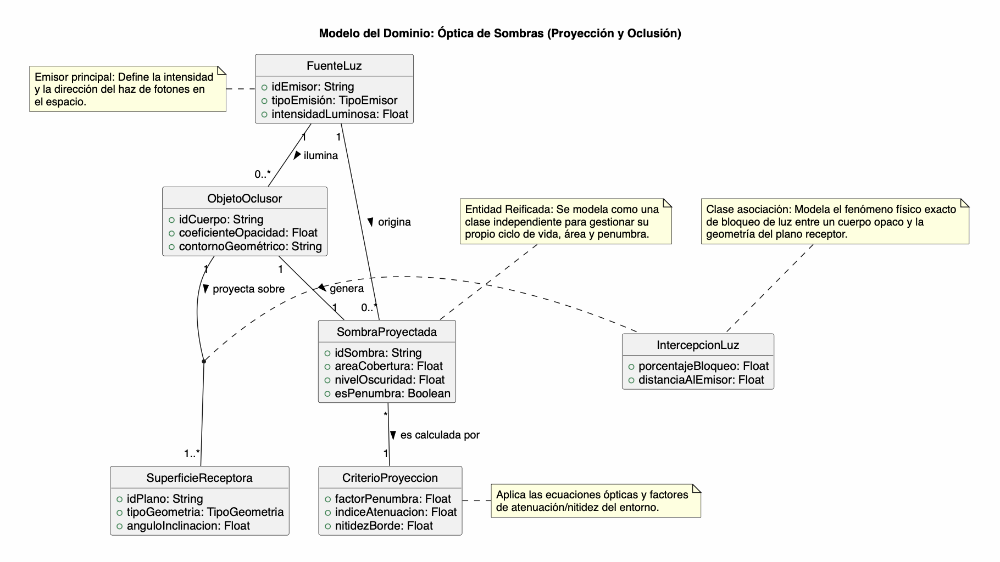

# Modelo del Dominio: Óptica de Sombras

## 1. Contexto del Modelo del Dominio

El **Modelo del Dominio de Sombras** describe la interacción física y óptica entre una fuente emisora de luz, un objeto opaco o semiopaco que interrumpe su trayectoria, la sombra resultante de dicha oclusión y la superficie receptora sobre la cual se proyecta geométricamente.

### Flujo del Dominio
1. Una **Fuente de Luz** emite radiación luminosa e ilumina el entorno espacial.
2. Un **Objeto Oclusor** intercepta y bloquea parcialmente la trayectoria lineal de los fotones.
3. Se produce una **Intercepción de Luz** al colisionar el haz luminoso con la superficie del objeto y el plano receptor
4. El **Criterio de Proyección** calcula los coeficientes ópticos (penumbra, nitidez y oscurecimiento) según las distancias físicas.
5. Se materializa una **Sombra Proyectada** con un área y nivel de oscuridad definidos sobre la **Superficie Receptora**.

---

## 2. Glosario de Términos

| Término | Definición Técnica y Operativa |
| :--- | :--- |
| **Fuente de Luz** | Entidad emisora de flujo luminoso o radiación electromagnética visible en el espacio. |
| **Objeto Oclusor** | Cuerpo físico opaco o semiopaco que bloquea, absorbe o desvía la luz entrante. |
| **Intercepción de Luz** | Fenómeno físico de oclusión espacial resultante del bloqueo del vector luminoso entre el objeto y la superficie. |
| **Sombra Proyectada** | Región de penumbra u oscuridad reificada que se manifiesta en el espacio receptor tras la oclusión. |
| **Superficie Receptora** | Geometría o plano receptor que interseca el volumen cónico de sombra y permite su visualización. |
| **Criterio de Proyección** | Conjunto de reglas físicas y ópticas que determinan el degradado, penumbra y nitidez del borde de la sombra. |
| **Grado de Opacidad** | Coeficiente numérico que determina la cantidad de flujo luminoso retenido por el objeto |

---

## 3. Suposiciones del Modelo

1. **Propagación Rectilínea de la Luz:** Se asume que la luz viaja en línea recta a través de un medio homogéneo sin considerar efectos de difracción compleja.
2. **Dependencia Causal de Oclusión:** Una sombra es una entdad reificada que no puede existir de forma independiente sin la coexistencia simultánea de una fuente emisora y un objeto oclusor.
3. **Manifestación geométrica única:** Cada proyección de sombra se materializa de forma continua sobre la topología y ángulo de inclinación de la superficie receptora.

---

## 4. Decisiones de Modelado

### Decisión 1: Sombra como Entidad Reificada
* **Decisión:** Se modela `SombraProyectada` como una clase explícita de dominio en lugar de un mero atributo de la superficie.
* **Justificación:** Permite gestionar un ciclo de vida independiente, calcular áreas de cobertura, niveles de penumbra y asociar múltiples fuentes o múltiples objetos oclusores sin acoplar innecesariamente la estructura a la superficie.

### Decisión 2: Clase Asociación (`IntercepciónLuz`)
* **Decisión:** Se utiliza `IntercepcionLuz` como clase asociación entre `ObjetoOclusor` y `SuperficieReceptora`.
* **Justificación:** El porcentaje de bloqueo y la distancia relativa varían según la posición espacial del objeto con respecto a la superficie específica donde cae la proyección.

### Decisión 3: Aislamiento de Reglas Físicas (`CriterioProyección`)
* **Decisión:** Las fórmulas ópticas para difuminado de bordes y cálculo de umbral de penumbra se abstraen en la clase `CriterioProyeccion`.
* **Justificación:** Facilita cambiar las reglas físicas (por ejemplo, pasar de luz puntual a luz de área) sin alterar la estructura conceptual de los objetos ni de la superficie.

---

## 5. Representación Gráfica del Modelo

